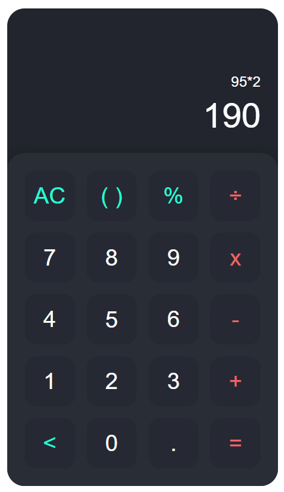

# Calci - A Simple Calculator Web App

Calci is a simple and user-friendly calculator web application that supports basic arithmetic operations and features a sleek design.

## Features

- Basic arithmetic operations: addition, subtraction, multiplication, and division.
- User-friendly interface with a sleek design.
- Available in both light and dark themes.


## Getting Started

To get a local copy up and running, follow these simple steps.

### Prerequisites

- A web browser

### Installation

1. **Clone the repo**
    ```sh
    git clone https://github.com/rakeshreddyadina/Calci-Web.git
    ```

2. **Navigate to the project directory**
    ```sh
    cd Calci-Web
    ```

3. **Open the `index.html` file in your browser**

## Usage

- Open the app in your web browser.
- Enter your arithmetic expression using the on-screen buttons.
- Press the `=` button to see the result.

## Live Demo

Check out the live demo of Calci [here](https://rakeshreddyadina.github.io/Calci-Web/).

## Screenshots

### Calci



